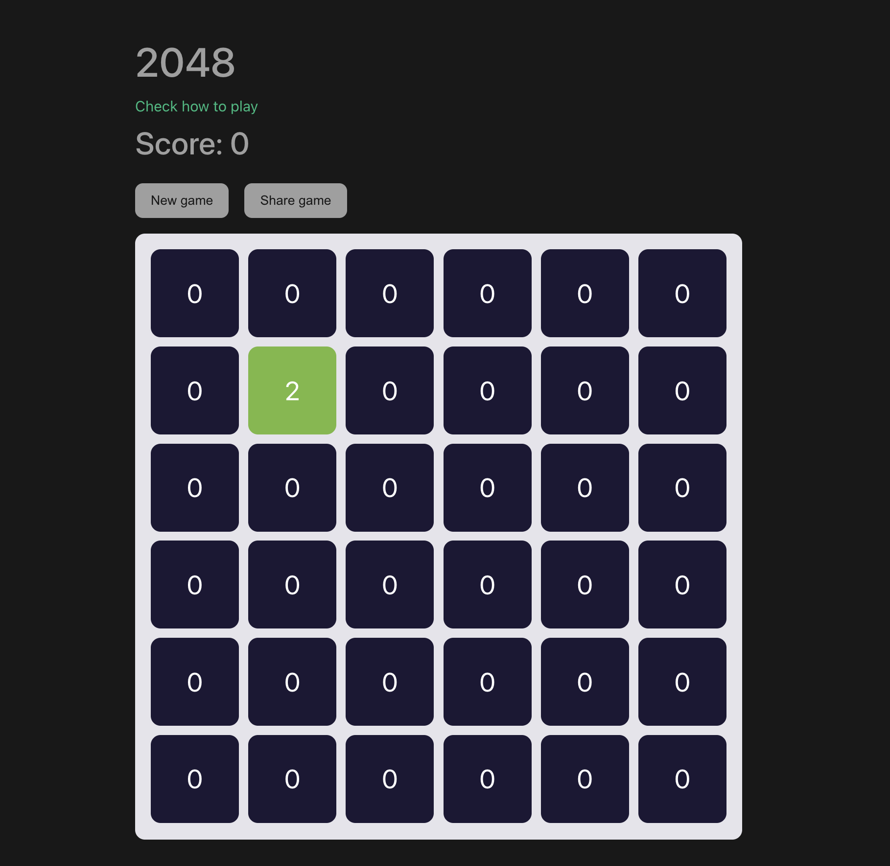
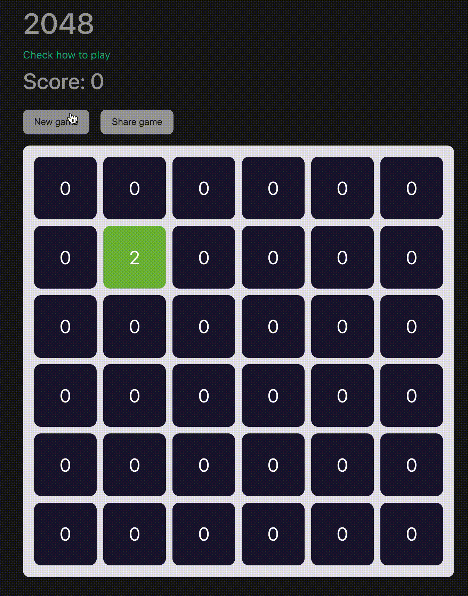

# 2048

Tech: Vue 3 + Vite + TS.

## Project Setup

```sh
npm install
```

## Compile and Hot-Reload for Development

```sh
npm run dev
```

### Type-Check, Compile and Minify for Production

```sh
npm run build
```

### Lint with [ESLint](https://eslint.org/)

```sh
npm run lint
```

### 2048 Game Features:
- Theme reused from vue starter (fonts, partly colors, day night theme, assets from web)

- Default start: 6x6, one random tile with 2



- Read rules before play



- Score, animated when you get updates of your game score

- Game state saving to local storage, so you can continue your game in any time

- Also, if you want to continue playing on another device or share with friend, you can use `Share Game` button. Under the hood it's copy to clipboard link with data of game state in query.

- When you win game or loose it, no problem! Start new one. Futhermore you can customize your board. 

- In new game form you can customize: `Obstacles` and `Size of board`.

## Type Support for `.vue` Imports in TS
TypeScript cannot handle type information for `.vue` imports by default, so we replace the `tsc` CLI with `vue-tsc` for type checking. In editors, we need [TypeScript Vue Plugin (Volar)](https://marketplace.visualstudio.com/items?itemName=Vue.vscode-typescript-vue-plugin) to make the TypeScript language service aware of `.vue` types.

If the standalone TypeScript plugin doesn't feel fast enough to you, Volar has also implemented a [Take Over Mode](https://github.com/johnsoncodehk/volar/discussions/471#discussioncomment-1361669) that is more performant. You can enable it by the following steps:

1. Disable the built-in TypeScript Extension
    1) Run `Extensions: Show Built-in Extensions` from VSCode's command palette
    2) Find `TypeScript and JavaScript Language Features`, right click and select `Disable (Workspace)`
2. Reload the VSCode window by running `Developer: Reload Window` from the command palette.
